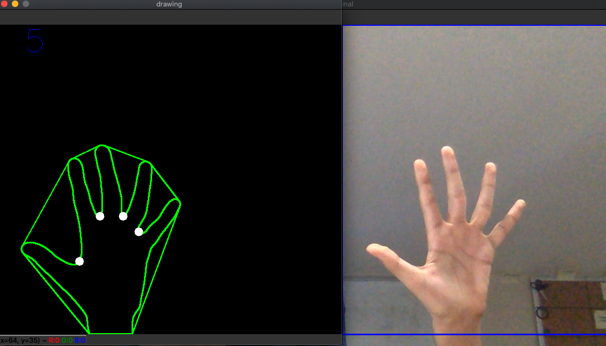
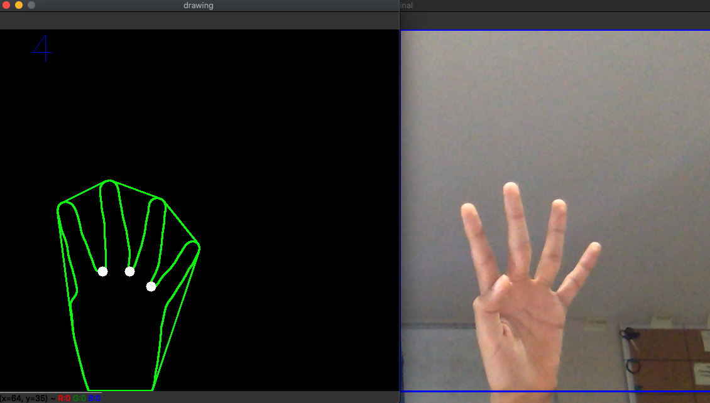

# Count number of fingers

I used opencv to detect the number of fingers a user is holding up. 

## Removing the background 

We first have to write a function to remove the background so that everything other than the user's fingers is hidden. We first build a background subtractor model: 

```python
bgModel = cv2.BackgroundSubtractorMOG2(0, bgSubThreshold)
```

The next step to do would be to calculate the number of fingers the user is holding up. 

We first create a convex hull of the user's hand: 

```python
hull = cv2.convexHull(result, returnPoints = False)
```

In simple words, this creates a shape surrounding the object. Here is a sample image of both the original and the convex hull: 

*insert images here* 

Next, we create a convexityDefects function. This function  gets all the defects of the contour and we save them in another array 
Defects are the lowest points between one finger and the other.

However, convexityDefects returns more points than we need, so we have to filter them. We filter them based on their distance from the center of the rectangle.Therefore, only the lowest points between each finger are kept. 

```python
defects = cv2.convexityDefects(result, hull)
```
Now comes the fun part. We now write the algorithm that checks if the defects detected are actually "fingers". In order to do this, we have to use a bit of math: 

```python
a = math.sqrt((end[0] - start[0]) ** 2 + (end[1] - start[1]) ** 2)
b = math.sqrt((far[0] - start[0]) ** 2 + (far[1] - start[1]) ** 2)
c = math.sqrt((end[0] - far[0]) ** 2 + (end[1] - far[1]) ** 2)
```

In the above code, we are calculating the distance between the defects using the Distance Formula which states that the distance between any 2 points (x_1, y_2) and (x_2, y_2) is sqrt((x2-x1)^2+(y2-y1)^2). 

Now that we have the distances, we need to find the angle. To do this, we use the Law Of Cosines: 

```python
angle = math.acos((b ** 2 + c ** 2 - a ** 2) / (2 * b * c))
if angle <= math.pi / 2:  
    count += 1
    cv2.circle(drawing, far, 8, [255, 255, 255], -1)
```
Here we get the angle and check if its less than 90 degrees. If it is then we increment the finger counter by 1 and we also draw a small circle on the user's finger indicating that the finger has been counted. 

The rest is seting up the keyboard so that when the user presses "b" on their keyboard it captures their background. 

## Running the code







# References

https://github.com/lzane/Fingers-Detection-using-OpenCV-and-Python


